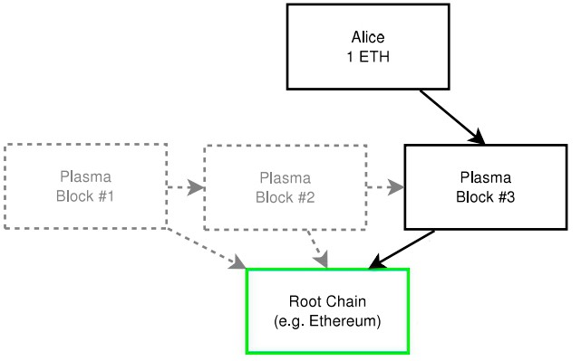
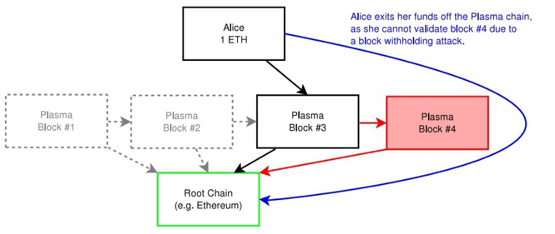
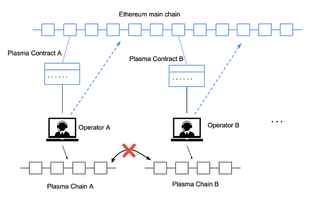

# Plasma

This repo is a introduction and note about Plasma 

> Plasma uses **a combination of smart contracts and cryptographic verification**. Together, these enable fast and cheap transactions by offloading these transactions from the main Ethereum blockchain into a **"side" chain** (sometimes referred as child or plasma chains). These side chains periodically report back to the main chain and use it to settle any disputes (almost like a higher court).

## Contents

- [**original paper**](#original-paper)

- [**工作原理**](#工作原理)
  - [**欺诈证明**](#欺诈证明)
  - [**举例说明**](#举例说明)
  - [**Plasma 的问题**](#Plasma-的问题)
- [**Plasma MVP 以及 Plasma Cash**](#Plasma-MVP-以及-Plasma-Cash)
  - [**Plasma MVP**](#Plasma-MVP)
  - [**Plasma Cash**](#Plasma-Cash)

### original paper

- [Plasma: Scalable Autonomous Smart Contracts](https://plasma.io/plasma.pdf)

### 工作原理

Plasma 结构是通过使用智能合约和 Merkle 树来构建的，从而可以创建无限数量的子链——其本质上是父以太坊区块链的迷你副本。 每条链都以各自的方式工作，通过共存和独立运行来满足不同的需求。 在每个子链的顶部，可以创建更多链，这就是构建树状结构的原因。

主要思想是建立一个**侧链框架**，它将尽可能少地与主链（在这种情况下是以太坊）进行通信和交互。 这样的框架被设计成操作一个**树状**的区块链，它以**分层方式**排列，使得可以在主区域之上创建许多较小的链。这些较小的链也称为 Plasma chain 或者子链。

具有状态转换的 Plasma 资产的存款和取款可通过**欺诈证明**来实现。 这确保了**可执行的状态**和**可交换性**。 它还允许在基础平台上以较少的数据负载处理大量交易。 任何用户都可以向其他人发送资产，包括来自不同参与者的资金。 可以使用原生平台代币支付和提取这些资金转账。

#### 欺诈证明

子链和根链之间的通信通过**欺诈证明**来保证安全性。每条子链都有自己特定的验证块的机制和防欺诈实现，同时也可以基于不同的共识算法构建。最常见的是 PoW 工作量证明，PoS 权益证明和 PoA 。

欺诈证明可确保一旦有恶意活动，用户能够报告不诚实的节点，保护其资金并退出交易（这涉及与主链的交互）。换句话说，欺诈证明被用作 Plasma 子链向其父链或根链提出申诉的一种机制。

这些证明使用交互式提款协议。为了提取一定数量的资金，需要**退出时间**。退出方必须通过 UTXO 模型确认输出以请求退出。然后，网络参与者可以提交一份证明，即如果已花费任何资金，则必须进行确认和测试。如果有所出入，则将其视为欺诈，并取消确认。随着时间的流逝，另一个绑定回合允许撤回发生，并在提交的时间戳之前回复到原状态。参与者可能会迅速退出错误的 Plasma 链。发生攻击时，参与者可以快速退出并节省成本，从而确保系统内的安全性。

#### 举例说明

#### Plasma 的问题

Plasma 通过将高频的交易迁移到以太坊网络之外的 **侧链** 之上，**定期将批量交易的哈希值发布到以太坊主网**，然后设置一些 **防恶意攻击机制** ，确保资金安全性。最终的目的是为以太坊扩容，提升交易吞吐量，减少交易成本。

但是最终暴露出两个问题：

1. **数据可用性** ：因为仅将批量交易的整体哈希值发布到 Layer 1 上，而不是每一笔交易均发布到底层公链，所以具体的交易数据不存在 Layer 1 上，**用户需要自己存储具体的交易数据**。
2. **用户体验差** ：为了避免恶意攻击，Plasma 在设计挑战期的机制的时候，用户需要**定期上线网络**，否则可能错过而遭受不必要的损失。它**只能够把支付做好**，**对于稍微复杂的智能合约却无能为力**。**作恶的一方是不会把数据给你提交上链，以至于这种争议至少要等两个星期才能解决**。这个过程是对于用户来说难以接受的。

在最坏的情况下，如果所有用户都需要退出一个 Plasma 链，那么**该链的整个有效状态必须在一个挑战期内发布到以太网主网上**。考虑到 Plasma 链可以任意增长，而以太坊区块已经接近其容量，几乎不可能将整个 Plasma 链倾倒到以太坊的主网上。因此，几乎可以肯定的是，大量退出会把以太坊挤爆。这就是所谓**批量退出问题**。

### Plasma MVP 以及 Plasma Cash

Plasma 作为一个框架，众人对此进行了衍生，于是产生了多种 Plasma ，这里我们介绍两个比较常见的项目：

#### Plasma MVP

**Plasma MVP(Minimal Viable Plasma)，最小可行性的Plasma**

在每个 Plasma chain 中会有一个 operator，operator 负责**产生区块**。如果我们需要准入 Plasma chain 的话就需要进行一个 deposit 的过程，**此后 Plasma chain 每产生一个区块就必须和主链回馈**，即 Merkle root ，这样 Plasma chain 上产生的块才算是被 confirm。

由于每个 Plasma chain 之间是独立的，所以**不能直接进行跨链交易，必须借助主链才能进行**。

可以将每条 Plasma chain 想象成一件赌场，我们在进入赌场前需要把自己的钱兑换成赌场自己的筹码，这就是一个 deposit 的过程，在这间赌场里你的筹码是有潜在效益的，但是对于隔壁的赌场而言（另一条 Plasma chain）是完全没有意义的，当我们需要在另一间赌场里进行活动的时候，我们就需要把这些筹码兑换成现实中的货币，然后再去那间赌场将现实货币兑换成相应的筹码，这就相当于一个跨链的交易过程了。而赌场里的交易需要记录，然后和政府报备之后这些交易才具有效益。

当然，我们为了保证安全性，在兑换筹码的时候需要有一定时间的缓冲期，这段时间就被称为**挑战期**，如果在这段时间里有人提出你在赌场造假的证据，那你就无法兑换成现实货币了。

#### Plasma Cash

相较于 Plasma MVP ，Plasma Cash 对此做了两处修改：

1. 每一笔存到 Plasma contract 的钱，都会赋予一个 unique token ID
2. Merkle tree 的 index 存的是 token ID，内容存的是这个 token ID 的交易记录

这样的话，**你每次存进去的钱都是独立的**，当有人想要去偷钱的时候，他需要一次次去分散操作，**但是这样也让这样两笔钱你无法合并使用**。而第二点，相当于 token ID 作为索引，**加快查询的速度**，但是与之而来的是**对于存储的要求的提升**。