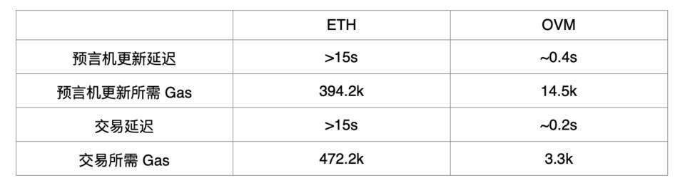

# Optimistic Rollup

## Content

- [**简述**](#简述)
- [**优点和缺点**](#优点和缺点)
- [**代表性项目**](#代表性项目)

### 简述

- Optimistic Rollup 保留了 calldata，可以**主链获得所有 layer2 的数据**，但那些**刷新 Layer-2 状态的交易不会在链上被验证**，只让主链存储一系列的历史状态根，添加了一个新的状态的一段时间（例如 1 周）后才将新状态最终敲定，也就是**数据可用性放在链下**。采用**欺诈证明**（跟 Plasma 方案一样），对提交无效状态的执行者进行惩罚。其**链下 OVM 虚拟机可以支持任意智能合约逻辑的实现，与以太坊 EVM 虚拟机搭配使用**，开发者就可以用 Solidity 来写码，实现 dapp 和智能合约之间的无缝互操作性。它的缺点是**安全问题**，只有使用 1～2 周的欺诈证明挑战期才足够安全。**在挑战期过去以前，没有交易能被认为是确定的**。
- EVM 和 OVM 的对比

- **合并共识**使得链下的共识系统可以完全在**以太坊上验证**，而不需要任何花哨的零知识加密。

  **假设每个区块都是有效的**，那么 Optimistic Rollup 又将如何处理运营者的错误行为呢？

  答案是使用 **欺诈证明** 。欺诈证明是**运营商执行无效操作的计算证明**。如果运营商发布了一个无效的状态转换，任何人都可以提交一个证明，证明该转换无效，然后恢复那些交易（大约 1 周的时间）。**由于这些证明是非交互式的，它们可以由任何人发送：不需要由用户监控自己的代币的安全性**。

  然而，与 ZK Rollup 不同的是，Optimistic Rollup **需要 3-5 倍的事务数据**才能完成。这些数据主要包括 **签名数据** （ZK Rollup 不需要这些数据，因为它在零知识中验证了那些数据） 之类的见证。在**最好的情况下，除非提交欺诈证明，否则 Optimistic Rollup 交易永远不需要验证**。然而，对链上见证进行验证和发布很昂贵，并且开发人员已经探索了**允许廉价的大规模验证和减少交易数据需求的聚合签名机制**。这种优化可以将 Optimistic Rollup 的理论 TPS 从目前的约 450 TPS 一直增加到潜在的约 2,000 TPS。

  Optimistic Rollup 提供了一组与 ZK Rollup 非常不同的权衡。它们的**成本较低** （假设欺诈带来的挑战极其罕见） ，但是它们的**安全性较差**，换句话说，**一直存在不正确地应用事务、之后再予以恢复的可能性**。这个安全窗口可以长达一个星期。因此，用户在这个安全窗口期无法退出 （否则，他们可能会拿着别人的资金跑掉） 。

  然而，可以通过引入**二级市场**来改善这些退出问题。**用户可以将他们的退出权出售给第三方流动性提供者，以换取少量的费用**。 （流动性提供者将因持续一周的流动性不足而获得回报） 。这将允许用户立即退出 Rollup 链。

- **当前 Optimistic Rollup 的问题**

  - **欺诈证明**
  - **集中化**
  - **提款延迟**

  Optimistic Rollup 方案具有一种**反网络效应**，即**单个 Optimistic Rollup 的交易量越大，全节点验证者会越少**，即，依靠「1 of N」 的诚实假设是更不安全的。

  「1 of N」 诚实假设是指，参与者虽然有 N 个，只要其中**至少有一个按期望运作，系统就会正常工作**。任何基于欺诈证明的系统都属于这一类，可信设置也是如此，尽管在这种情况下，N 通常更小。但你希望 N 尽可能地大。

### 优点和缺点

- **优点**
  1. 通用计算的灵活性（图灵完备 / 兼容 EVM）
  2. 可扩展性的增加（每秒 200 到 2000 个交易（tps），以太坊第 1 层当前为 10 tps）
  3. 所有数据都可以在链上使用（无需信任链下数据提供者）
  4. 更好的用户体验
- **缺点**
  1. 与某些其他第 2 层解决方案（ Plasma，ZK-Rollup 等）相比，吞吐量受到限制
  2. 存在一些其他安全问题

### 代表性项目

- IDEX

  IDEX 是一个基于以太坊的分散式智能合约交易平台，提供实时交易，即时订单放置和处理，免费取消订单，实时订单簿更新等服务。IDEX 由一个智能合约，一个交易引擎和一个交易处理仲裁器组成，所有交易必须由用户的私钥授权。